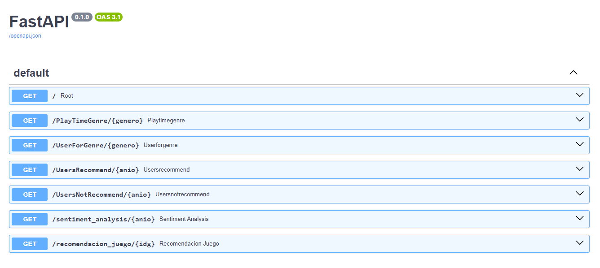

# Proyecto Individual MLops - Sistema de Recomendación de Steam


## Descripción

Este proyecto consiste en la implementación de una API utilizando el framework FastAPI para ofrecer servicios mediante la plataforma de despliegue Render. Ofrece funcionalidades con datos de videojuegos de la plataforma Steam sobre análisis de sentimiento de reseñas de usuarios y sistemas de recomendación.

### Características Principales

1. **Transformaciones y Feature Engineering:**
   
   - Lectura y manipulación de datos.
   - Eliminación de columnas no necesarias para consultas o modelos.
   - Transformación de generos a Formato Binario.
   - Análisis de sentimiento a las reseñas de usuarios.
   - Encontramos Juegos Similares mediante la similitud del coseno.
   - Diccionario de datos (MVP):
     
     - `gamesoh.parquet`: contiene 61 columnas: 'item_id' del tipo entero corresponde al identificador unico de los juegos, 60 columnas categoricas (géneros) en binario.
         #   Column                 Non-Null Count  Dtype   Descripción
        ---  ------                 --------------  -----   -----------
         0   item_id                29803 non-null  int32   Identificador unico de juego
         1   2D                     29803 non-null  int8    Género
         2   ACTION                 29803 non-null  int8    Género
         3   ADVENTURE              29803 non-null  int8    Género
         4   ANIME                  29803 non-null  int8    Género
         ...
         59  VIOLENT                29803 non-null  int8    Género
         60  VISUAL NOVEL           29803 non-null  int8    Género
         61  ZOMBIES                29803 non-null  int8    Género
       
     - `reviews.parquet`: contiene 5 columnas:
         #   Column              Non-Null Count  Dtype   Descripción
        ---  ------              --------------  -----   -----------
         0   posted              59305 non-null  int32   Año de publicación de la reseña
         1   item_id             59305 non-null  int32   Identificador unico de Juego
         2   recommend           59305 non-null  bool    Indicador de recomendacion de usuario verdadero o falso
         3   user_id             59305 non-null  int32   Identificador unico de usuario
         4   sentiment_analysis  59305 non-null  int8    Analisis de sentimientos 0=Negativo, 1=Neutral, 2=Positivo
       
     - `itemso.parquet`: contiene 3 columnas:
         #   Column            Dtype     Descripción
        ---  ------            -----     ----------- 
         0   item_id           int32     Identificador unico de Juego
         1   playtime_forever  int32     Cantidad de Horas acumuladas por usuario por juego
         2   user_id           int32     Identificador unico de usuario
       
     - `games.parquet`: contiene 3 columnas:
         #   Column        Non-Null Count  Dtype   Descripción
        ---  ------        --------------  -----   ----------- 
         0   title         29802 non-null  object  Nombre del Juego
         1   release_date  29803 non-null  int32   Fecha de lanzamiento del Juego
         2   item_id       29803 non-null  int32   Identificador unico de Juego
       
     - `fnames.parquet`: contiene 2 columnas:
         #   Column     Non-Null Count  Dtype   Descripción
        ---  ------     --------------  -----   ----------- 
         0   item_id    565 non-null    int32   Identificador unico de Juego
         1   item_name  565 non-null    object  Nombre del Juego
       
     - `unames.parquet`: contiene 2 columnas:
         #   Column     Non-Null Count  Dtype    Descripción
        ---  ------     --------------  -----    -----------
         0   user_id    87998 non-null  int32    Identificador unico de usuario
         1   user_name  87998 non-null  object   Nombre de usuario

       
2. **Desarrollo de la API:**
   
   - Implementación de endpoints para realizar consultas específicas.
   - Consultas disponibles:
     - `PlayTimeGenre`: Toma como parametro un valor del tipo String y devuelve el año con más horas jugadas para un género específico.
     - `UserForGenre`: Toma como parametro un valor del tipo String y devuelve el usuario que acumula más horas jugadas para un género y una lista de la acumulación de horas jugadas por año.
     - `UsersRecommend`: Toma como parametro un valor del tipo int y devuelve el top 3 de juegos MÁS recomendados por usuarios para un año dado.
     - `UsersNotRecommend`: Toma como parametro un valor del tipo int y devuelve el top 3 de juegos MENOS recomendados por usuarios para un año dado.
     - `sentiment_analysis`: Toma como parametro un valor del tipo int y devuelve la cantidad de registros de reseñas de usuarios categorizados con un análisis de sentimiento para un año dado.

3. **Deployment:**
   
   - Utilización de Render para desplegar la API y hacerla accesible desde la web.

4. **Análisis Exploratorio de Datos (EDA):**
   
   - Exploración de relaciones entre variables, identificación de outliers y patrones interesantes en el conjunto de datos.
   - Generación de nubes de palabras para comprender las palabras más frecuentes en los títulos de los juegos.

5. **Modelo de Aprendizaje Automático:**
   
   - Implementación de al menos uno de los sistemas de recomendación propuestos:
     - `recomendacion_juego`: Toma como parametro un valor del tipo int y devuelve un top 5 de juegos recomendados (similares).

### Uso

1. **Uso de la API:**
   
   Puede utilizar cualquiera de las endpoints definidas mas arriba, así también el modelo de recomendación.
   
   - Ejemplo de consulta `PlayTimeGenre`:
     
     ```python
     import requests  
     response = requests.get('https://pi-ml-ops-pt.onrender.com/PlayTimeGenre/action') 
     print(response.json())
     ```
     
     Ejemplo de resultado:
     `{'Año de lanzamiento con más horas jugadas para Género ACTION': 2012}`

2. **Uso de Documentacion FastAPI**
   
   - Link del deploy: [Render](https://pi-ml-ops-pt.onrender.com/docs)
   
   - Ejemplo de consulta `PlayTimeGenre`:
     
     - Haga click en la funcionalidad deseada, en este caso `PlayTimeGenre`.
       
       
     
     - Haga click `Try it out` y luego ingrese el genero deseado.
       
       
     
     - Haga click en `Execute`.
       
       
     
     - El resultado de la consulta estara en el recuadro debajo de `Response body`.
       
       

### Soporte

Para obtener ayuda o realizar preguntas, puedes abrir un problema mediante la plataforma [Slido](https://app.sli.do/event/91QKwt3an5ty6VyKnxUQYp).

o al correo electronico [gmail](angelprieto92@gmail.com).

## ¡Gracias por usar nuestra API! ¡Esperamos que sea de utilidad! 🚀
