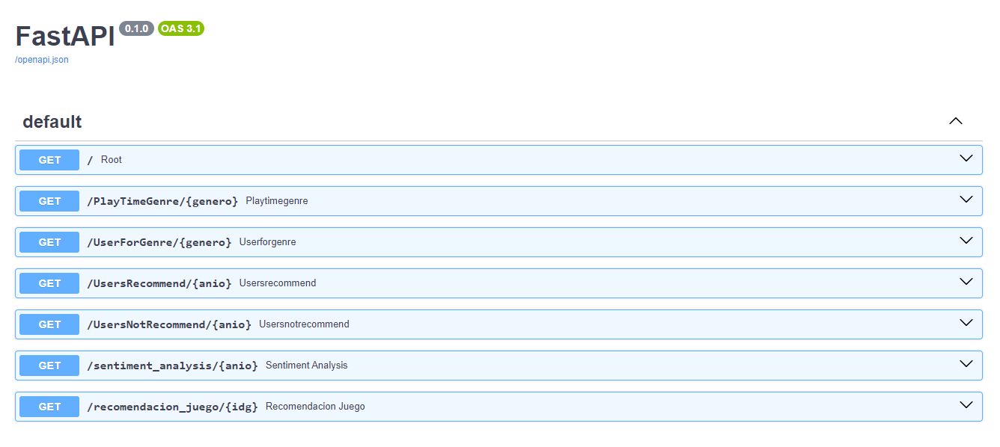
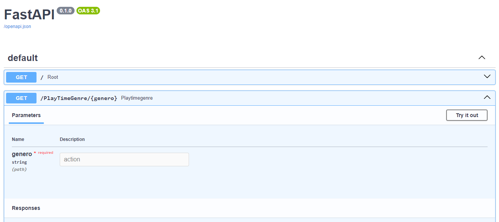
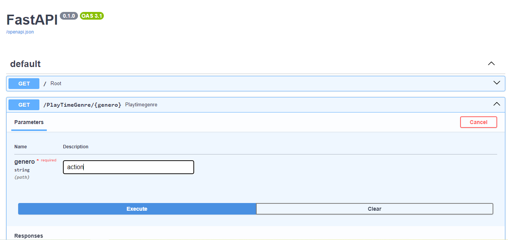
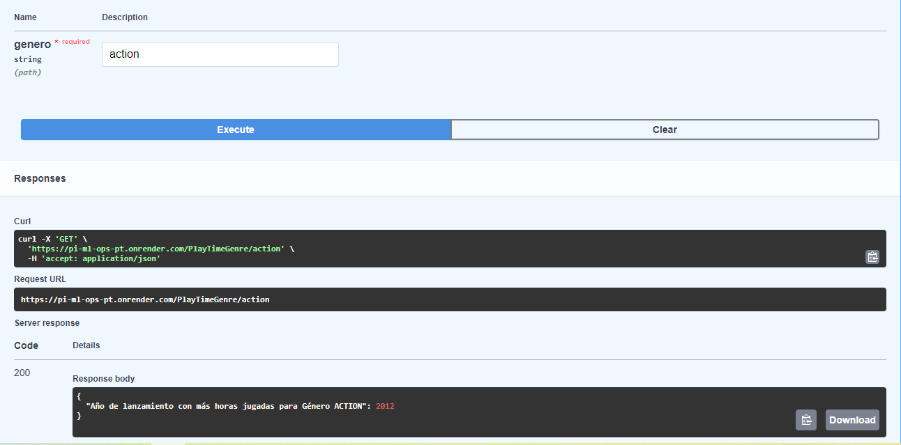

# Proyecto Individual MLops - Sistema de Recomendación de Steam


## Descripción

Este proyecto consiste en la implementación de una API utilizando el framework FastAPI para ofrecer servicios mediante la plataforma de despliegue Render. Ofrece funcionalidades con datos de videojuegos de la plataforma Steam sobre análisis de sentimiento de reseñas de usuarios y sistemas de recomendación.

### Características Principales

1. **Transformaciones y Feature Engineering:**
   
   - Lectura y manipulación de datos.
   - Eliminación de columnas no necesarias para consultas o modelos.
   - Transformación de generos a Formato Binario.
   - Análisis de sentimiento a las reseñas de usuarios.
   - Encontramos Juegos Similares mediante la similitud del coseno.

2. **Desarrollo de la API:**
   
   - Implementación de endpoints para realizar consultas específicas.
   - Consultas disponibles:
     - `PlayTimeGenre`: Toma como parametro un valor del tipo String y devuelve el año con más horas jugadas para un género específico.
     - `UserForGenre`: Toma como parametro un valor del tipo String y devuelve el usuario que acumula más horas jugadas para un género y una lista de la acumulación de horas jugadas por año.
     - `UsersRecommend`: Toma como parametro un valor del tipo int y devuelve el top 3 de juegos MÁS recomendados por usuarios para un año dado.
     - `UsersNotRecommend`: Toma como parametro un valor del tipo int y devuelve el top 3 de juegos MENOS recomendados por usuarios para un año dado.
     - `sentiment_analysis`: Toma como parametro un valor del tipo int y devuelve la cantidad de registros de reseñas de usuarios categorizados con un análisis de sentimiento para un año dado.

3. **Deployment:**
   
   - Utilización de Render para desplegar la API y hacerla accesible desde la web.

4. **Análisis Exploratorio de Datos (EDA):**
   
   - Exploración de relaciones entre variables, identificación de outliers y patrones interesantes en el conjunto de datos.
   - Generación de nubes de palabras para comprender las palabras más frecuentes en los títulos de los juegos.

5. **Modelo de Aprendizaje Automático:**
   
   - Implementación de al menos uno de los sistemas de recomendación propuestos:
     - `recomendacion_juego`: Toma como parametro un valor del tipo int y devuelve un top 5 de juegos recomendados (similares).

### Uso

1. **Uso de la API:**
   
   Puede utilizar cualquiera de las endpoints definidas mas arriba, así también el modelo de recomendación.
   
   - Ejemplo de consulta `PlayTimeGenre`:
     
     ```python
     import requests  
     response = requests.get('https://pi-ml-ops-pt.onrender.com/PlayTimeGenre/action') 
     print(response.json())
     ```
     
     Ejemplo de resultado:
     `{'Año de lanzamiento con más horas jugadas para Género ACTION': 2012}`

2. **Uso de Documentacion FastAPI**
   
   - Link del deploy: [Render](https://pi-ml-ops-pt.onrender.com/docs)
   
   - Ejemplo de consulta `PlayTimeGenre`:
     
     - Haga click en la funcionalidad deseada, en este caso `PlayTimeGenre`.
       
       
     
     - Haga click `Try it out` y luego ingrese el genero deseado.
       
       
     
     - Haga click en `Execute`.
       
       
     
     - El resultado de la consulta estara en el recuadro debajo de `Response body`.
       
       

### Soporte

Para obtener ayuda o realizar preguntas, puedes abrir un problema mediante la plataforma [Slido](https://app.sli.do/event/91QKwt3an5ty6VyKnxUQYp).

o al correo electronico [gmail](angelprieto92@gmail.com).

## ¡Gracias por usar nuestra API! ¡Esperamos que sea de utilidad! 🚀
